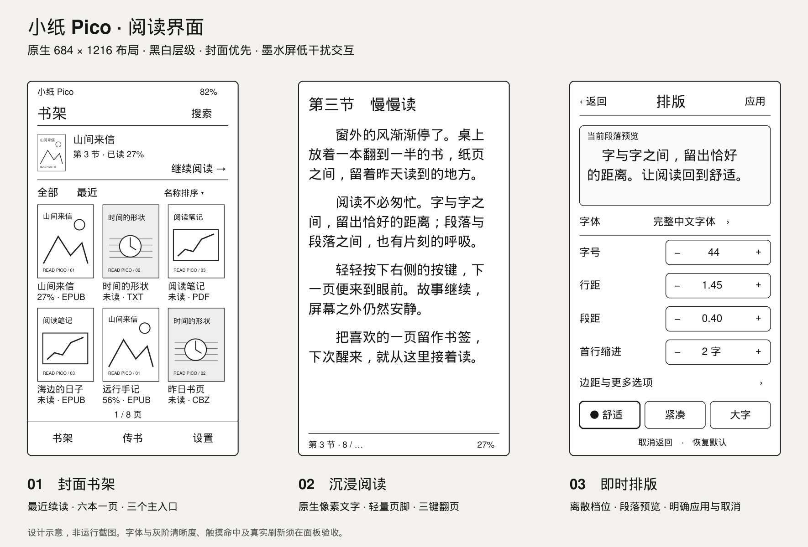

# 小纸 Pico 阅读固件 / Read Pico Reader

面向 Read Pico RDP-G01-W 的独立电子书固件设计项目。`pico_nano` 是开发目录及内部项目名；面向用户的中文名称为“小纸 Pico”，英文和日文为“Read Pico”。

**当前状态：已开始开发，0.0.39开发基础、介质租约、显示所有权、内容SHA/A-B位置、保存/每书100条书签管理、交互界面与跳转返回及TXT流式解码/有界分页、受限字体引擎、实际TXT页捕获及PC交互阅读/续读及设备TXT/内部非破坏挂载入口及共享文件书架及最近20条/继续阅读及逐书排版设置、EPUB容器/出版物结构及目录模型、XHTML正文事件及有界页节点/实际捕获和PNG逐行图片绘制及有界作者CSS图片版式和JPEG基线/渐进式解码层及出版物PNG/JPEG图片路径和原生EPUB导航会话/显示回执及语义位置A/B保存/恢复和实际EPUB应用/独立PC窗口及混合书架/设备路由已建立；ESP-IDF v6.1的CI与真机默认配置已编译。尚未烧写或真机验证，完整产品功能尚未完成。** 性能目标仍不是实测结果。参考固件与本项目相互独立，参考代码未修改。

## 阅读入口

| 文档 | 内容 |
| --- | --- |
| [当前构建与运行](docs/BUILDING.md) | 已实现入口、可复跑命令、模拟器与固件边界 |
| [存储与显示维护契约](docs/STORAGE_AND_DISPLAY.md) | 已实现租约、拔卡代次、缓冲所有权与场景测试 |
| [依赖来源](docs/DEPENDENCIES.md) | 复用摘要、组件许可、工具链 |
| [总体方案](docs/DESIGN.md) | 产品目标、架构取舍、关键决策、支持范围 |
| [产品需求](docs/PRODUCT_REQUIREMENTS.md) | 书库、阅读、封面、设置、睡眠、错误恢复 |
| [界面与交互](docs/UI_UX.md) | 像素布局、视觉规范、手势、三键、完整用户流程 |
| [技术架构](docs/ARCHITECTURE.md) | 模块、任务、消息、存储、内存、升级、硬件适配 |
| [格式与封面](docs/FORMATS.md) | TXT/EPUB/PDF/FB2/CBZ 的支持边界与解析策略 |
| [排版与刷新](docs/RENDERING.md) | 字体分辨率、段落、分页、预绘制、波形、缓存 |
| [快速传书](docs/TRANSFER.md) | 手机网页、热点、局域网、分块续传、USB、转换工具 |
| [字体上传与锁屏壁纸](docs/FONTS_AND_WALLPAPERS.md) | 字体安装管理、壁纸上传裁切、锁屏模式与断电缓存 |
| [开发计划](docs/DEVELOPMENT_PLAN.md) | 阶段依赖、具体任务、拟建文件、验收与估算 |
| [开发与PC模拟测试](docs/DEVELOPMENT_AND_TESTING.md) | 环境配置、共享代码模拟器、QEMU/Wokwi、命令与测试流程 |
| [验证与发布](docs/VALIDATION.md) | 样本、性能定义、可靠性、硬件与发布门槛 |
| [依据与待验证决策](docs/SOURCES_AND_DECISIONS.md) | 参考代码基线、官方资料、风险与验证方式 |

推荐顺序：总体方案 → 界面与交互 → 排版与刷新 → 快速传书 → 开发计划。

界面布局示意见 [三屏设计图](docs/assets/ui-overview.svg)。它是设计线框，不是运行中的固件截图；封面图案使用自绘几何占位。

## 本次设计基线

- 参考仓库：`D:/windssea/dev/read_pico_firmware`。
- 参考提交：`28cde682a4468a581c278761922724f57d976418`。
- 设计日期：2026-10-05（Asia/Shanghai）。
- 板型：ESP32-S3 / 16 MiB flash / 8 MiB PSRAM / 4.7 英寸 E0470A01。
- 设备原生目标：TXT、EPUB、PDF；FB2 与 CBZ 在完整版本加入。
- PDF 原生阅读是正式需求，必须先通过内存、性能和许可证技术门；MOBI/AZW3 可在电脑转换后传入。
- 无 DRM、无账号依赖，离线阅读；默认关闭无线网络。

当前工程可构建并打开TXT及原生EPUB，书架、续读、中文目录、七项排版预览和字体基础已接入。后续继续完成硬件基线与PDF技术验证；完整开发步骤见 [当前构建与运行](docs/BUILDING.md)。

内容身份与持久位置的已实现接口、线格式和限制见 [维护契约](docs/PERSISTENCE.md)。

书签、上次位置、继续阅读的需求覆盖与实现边界见 [阅读状态契约](docs/READING_STATE.md)。

TXT编码、源位置与当前分页边界见 [文本内核契约](docs/TEXT_CORE.md)。

真实文字捕获与字体边界见 [字体引擎说明](docs/FONT_PORT.md)。

Portions of this software are copyright © 2026 The FreeType Project (https://freetype.org). All rights reserved.

PC翻页、字号、关闭保存与续读的当前契约见 [阅读会话](docs/READER_SESSION.md)。

设备书架与TXT入口、初始化镜像及尚未验收的硬件边界见 [设备接入](docs/DEVICE_PORT.md)。

文件书架的操作、格式标识和当前限制见 [书架契约](docs/CATALOG.md)。

EPUB接入已开始：有界ZIP资源流和本地路径解析已建立，正文/目录/封面尚未接入。见 [资源层](docs/EPUB_CONTAINER.md)。

原生EPUB书签存储和跳转返回接口见[EPUB书签](docs/EPUB_BOOKMARKS.md)，中文管理入口已接入，真实设备体验尚待验证。

正文缺字回退与当前备用源入口见[字体回退](docs/FONT_FALLBACK.md)，完整字体管理界面仍在开发。

字体的全局与逐书持久恢复见[字体选择记录](docs/FONT_PREFERENCES.md)，管理界面与阅读中应用继续开发。

字体目录与只读中文样例预览见[字体检查](docs/FONT_INSPECTION.md)，选择/应用交互尚待接入。

活动阅读中的原文字体预览、取消与逐书应用API见[字体切换](docs/FONT_SWITCHING.md)，中文选择菜单仍待接入。

设备/PC的逐书正文与备用字体选择菜单见[中文字体选择](docs/FONT_PICKER_UI.md)，全局设置和上传管理继续开发。
