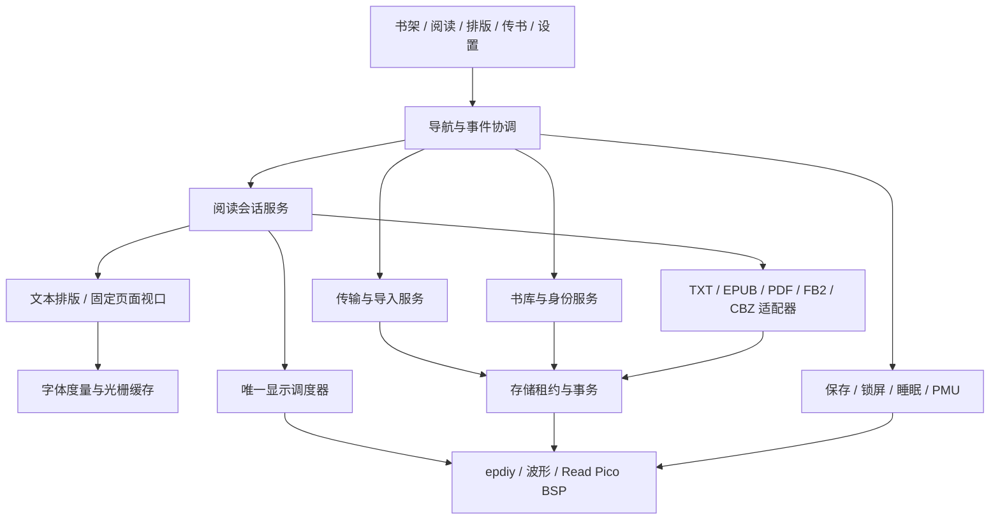

# 技术架构与维护契约

本文保留目标架构，当前实现与缺项以 [PROJECT_STATUS](PROJECT_STATUS.md) 为准。deadline/USB/升级等描述是验收目标；现有同步保存/解析等尚不具备全部deadline能力。

## 1. 分层与依赖



页面不得直接拼 PMU 协议、持有裸 SD 生命周期或调用高压轨写寄存器。解析器无 UI 依赖；显示调度器不解释章节；导入服务不直接改阅读页面状态。基础 C 组件可在主机用替身编译，FreeRTOS/IDF 依赖在 port 层。

## 2. 目标目录与职责（已部分创建，当前范围见BUILDING）

```text
main/app_main.c                 启动装配与恢复选择
components/pn_core/             状态、消息、取消 token、预算、内容身份
components/pn_port/             IDF 队列/时钟/文件/分配器适配
components/pn_ui/               坐标、tokens、绘制、命中与手势
components/pn_shell/            导航栈、页面控制器、用户意图
components/pn_library/          元数据目录、搜索、封面队列、集合
components/pn_reader/           阅读会话、位置、书签、预绘制、搜索
components/pn_format/           公共文档接口及 TXT/EPUB/FB2/CBZ
components/pn_pdf/              可替换 PDF 引擎、预算与视口
components/pn_font/             TTF、fallback、度量、缓存、字重
components/pn_display/          job 队列、波形选择、damage、恢复
components/pn_storage/          media epoch、lease、journal、索引与缓存
components/pn_transfer/         WiFi 生命周期、HTTP、上传会话与配对
components/pn_power/            保存屏障、浅睡/软睡/关机
components/pn_personalization/  字体索引、壁纸预处理与A/B锁屏缓存
components/pn_update/           双槽升级与启动确认
simulator/                     共享真实C组件的桌面显示/输入/故障回放
examples/qemu_smoke/            可选目标级最小模拟工程，排除真实BSP依赖
tests/host/                    可重复主机测试与故障注入
tests/fixtures/                合法、边界、损坏的自生成样本
tools/                         导入转换、部署、性能采集
docs/                          长期产品/技术/发布契约
docs/local/                    忽略的过程日志与实验结果
```

复用下层 `read_pico/cst836u/sc7a20h/fca9555/sy7636a/read_pico_pmu/epdiy/e0470_epaper_waveform`，记录来源与许可。参考 `main/book` 和字体代码作为拆分移植基础，不原样复制庞大 `app_book.c`。参考厂测与 VCOM 校准保留为独立维护路径。功能页不导入出厂演示的后台状态。

PC版只替换port与硬件边界，字体/排版/UI使用同一源代码；即时与慢刷新模型均不能代替面板实测。预算、截图、故障回放与真机分工见 [开发与测试流程](DEVELOPMENT_AND_TESTING.md)。

## 3. 任务与线程所有权

| 执行者 | 唯一拥有资源 | 优先级初值 | 核心与限额 |
| --- | --- | --- | --- |
| input/router | 导航状态与用户意图 | 6 | core 0，短回调；5–10 ms 轮询/中断唤醒 |
| display owner | epdiy、前后帧、波形与电源轨 | 5 | core 0 协调，保留底层已有扫描任务；不重绑其核 |
| reader worker | 当前文档、layout、正文 font context、PDF context | 3 | core 1，16 KiB 栈起步，监控水位 |
| import worker | 哈希、元数据、缩略图 | 2 | 仅空闲运行；PDF 渲染/阅读翻页时让出 |
| transfer HTTP | 请求读取与上传流 | 3 | IDF httpd，缓冲有界；不绘制屏幕 |
| storage control | 租约状态、事务提交、介质切换 | 4 | 小消息任务；文件 I/O 由获得租约的 worker 执行 |
| power/update | 保存屏障、升级与电源状态 | 4 | 与 storage/display 协作，不抢占在写介质 |

优先级和栈是初值，M0 用已有驱动基线测冲突后确定。WiFi/IDF 内部任务不可随意改核或优先级。ISR 只投递事件，不做 I2C/文件 I/O/刷新。

UI 使用独立常驻字体 context；正文与 PDF context 只由 reader worker 访问，避免全局 TTF 锁影响路由。显示消费不可变位图/绘图结果，不调用正文光栅引擎。预绘制 job 有代次、layout_key、page_id；过期 job 释放资源后丢弃，不得提交新会话画面。

## 4. 关键契约

`pn_job_token_t`、状态码、介质租约与显示所有权已在共享头文件落地，当前行为见 [维护契约](STORAGE_AND_DISPLAY.md)。下列整体文档/位置接口仍为目标设计，不能当作全部已实现：

```c
typedef struct { uint64_t session; uint32_t generation; } pn_job_token_t;
typedef struct { uint8_t sha256[32]; } pn_book_id_t;
typedef struct {
    pn_book_id_t book;
    uint32_t section;       // Text section or PDF/CBZ page / 文本章或固定页
    uint64_t source_offset; // Format-specific source position / 格式内原始位置
    uint32_t block;
    uint32_t utf8_offset;
    uint16_t viewport_x, viewport_y, zoom_permille;
} pn_location_t;
```

- `document_open(id, lease, budget, token)` 返回 capabilities：reflow、fixed_page、toc、text_search、images；不以扩展名直接确定支持。
- `reader_request(intent, token)` 异步产生 prepared_page / progress / failure；取消不强删在文件写入中的任务。
- `display_submit(page, damage, profile, token)` 接受引用计数不可变缓冲；显示完成才释放。队列最多一个正在显示与一个准备结果；旧 generation 丢弃。
- `storage_acquire(media_id, epoch, READ/WRITE/USB_EXCLUSIVE)` 必须失败或等待，不能取得失效介质；USB 独占前所有读写租约归零。
- `save_barrier(deadline)` 保证当前位置至少落到内部 A/B 记录或返回明确失败；失败时关机取消，意外掉电另靠恢复记录。

类型细节在对应阶段头文件落地；所有公开 C API 与结构成员中英双语注释。取消、超时与耗尽有不同错误码：CANCELLED、STALE_MEDIA、LIMIT、NO_MEMORY、UNSUPPORTED、CORRUPT、IO。UI 依据错误类别给可操作出口。

## 5. 图书身份、位置与数据持久化

当前流式SHA、A/B记录及TXT位置载荷已实现，调用边界见 [持久位置维护契约](PERSISTENCE.md)；导入/索引/内部挂载/保存屏障仍为后续设计。

新导入时流式算 SHA-256，`book_id=content SHA-256`；同内容不同路径映射一个书目，可按用户选择保留副本。原路径/大小/mtime 只做快速变更检测，不作为恢复进度的最终依据。USB 后导入需重新扫描，摘要未完成的文件标为“正在识别”，不恢复旧身份。

TXT 位置采用原文件字节偏移并携带编码/段落策略版本；规范化文本每 4 KiB checkpoint 记录源偏移映射。EPUB/FB2 用 spine/section＋规范化 block＋UTF-8 offset，另存前后各 32 字符锚点与资源摘要。换解析版本找不到锚点时显示“恢复到最近可定位段落”；PDF/CBZ 用原页＋视口，不受正文字号改变。

settings 存小型 NVS blob；频繁翻页不每页 NVS commit。最近位置每 5 页或停留 30 秒持久化（先到者），锁屏/离书必做屏障。内部 1 MiB data 分区内位置 journal 使用 A/B 记录、序号与 CRC，写新校验成功后旧记录可回收；由存储服务原子读取最近有效代。TF 上的完整书签/逐书设置与内部最近位置分开。

### TF 数据目录

```text
/sdcard/books/                  用户图书与 TXT 同名封面
/sdcard/fonts/                  完整 TTF 与许可证
/sdcard/wallpapers/             用户JPEG/PNG锁屏原图
/sdcard/.readpico/library/       分页索引、记录版本、内容与路径映射
/sdcard/.readpico/progress/      逐书位置/书签/设置 A/B 记录
/sdcard/.readpico/covers/        有界灰阶缩略图缓存
/sdcard/.readpico/layout/        字体摘要+排版键的页表缓存
/sdcard/.readpico/uploads/       上传分块、manifest、提交恢复日志
```

缓存可全部删除重建，原书/进度不可与缓存混在一类清理。库索引使用分页二进制记录（单页最多 64 书目），UI 只保留可见页＋邻页；不要求全书库常驻 RAM。索引 A/B 与尾日志用于恢复，不先引入 SQLite。

TF 拔出：提升 media epoch → 禁止新 lease → 通知 worker 取消 → 关闭句柄 → 内部保存屏障 → 字体回退 → 提示。重新插入必须显式挂载，核对新介质与摘要。内部 FAT 挂载失败禁止自动格式化；首次空分区初始化与损坏修复是两个明确路径。

## 6. 内存预算

单位 KiB，预算为同时峰值，不是各模块单独最大值。8 MiB=8192 KiB；不足时按可回收→压缩→取消顺序降级。

| 项目 | 文本阅读 | PDF/大图 |
| --- | ---: | ---: |
| 三张 4bpp 全屏位图 | 1219 | 1219 |
| epdiy 其他缓冲预留（M0 核实） | 768 | 768 |
| UI/正文度量＋LRU | 1024 | 384 |
| 文档与布局或 PDF 引擎堆 | 1280 | 3072 |
| 图片/条带缓存 | 640 | 512 |
| 书库＋进度＋可见封面 | 256 | 256 |
| 栈与 RTOS/通用结构 PSRAM部分 | 256 | 256 |
| 安全余量 | 1024 | 1024 |
| 合计 | 6467 | 7491 |

一个全屏帧精确 415872 bytes，三帧 1247616 bytes。硬件 DMA 要求内部 SRAM 的资源不能从上述 PSRAM“借用”；内部 SRAM 空闲下限目标 64 KiB、最大连续可分配块目标 32 KiB，M0 若基线不满足必须调整网络/栈/显示资源后再定门槛。

阅读与传书分时：传书中暂停正文预绘制，回收第三帧、大图片/PDF context，用释放额度容纳 WiFi 与最多 64 KiB 接收块；保留返回位置。字库整表映射不沿用参考 5 MiB 上限，按预算按需读取；PDF 模式不留正文大字形缓存。PDF 超预算即取消并给错误，不耗尽到系统崩溃。

## 7. Flash 与升级分区草案

16 MiB flash，DIO/HPM 配置必须与硬件验证相符。拟定布局如下，需 IDF 分区工具与实际映像大小验证后才能烧写：

| 分区 | offset | size |
| --- | --- | --- |
| nvs | 0x9000 | 0x6000 |
| otadata | 0xF000 | 0x2000 |
| phy_init | 0x11000 | 0x1000 |
| ota_0 | 0x20000 | 0x600000 |
| ota_1 | 0x620000 | 0x600000 |
| data（内部小书库与位置） | 0xC20000 | 0x100000 |
| assets（UI 字体/指南） | 0xD20000 | 0x1E0000 |
| wallpaper（私有锁屏A/B缓存） | 0xF00000 | 0x100000 |

终点 0x1000000。应用最大 6 MiB，发布要求至少 10% 余量；PDF 子集引擎超限时先裁掉未使用模块，不能破坏双槽回滚换容量。bootloader/表仍由 IDF 生成，烧写使用生成的 `flash_args`，禁止复用参考固件 app 偏移。

wallpaper独立1MiB，不挤占内部小书库/位置日志；存两张415872-byte处理后位图及元数据，应用时按A/B序号、CRC与同步约定提交。图片原图在TF，运行时锁屏只读内部有效缓存，失败使用系统默认；复制到显示目标帧，不增加常驻全屏帧。assets缩至1.875MiB，T01核验UI字体/指南容量与壁纸分区格式化后的实际可用空间。详见 [资源与恢复契约](FONTS_AND_WALLPAPERS.md)。

升级本地配对网页 → 固件完整摘要＋项目签名校验 → 写非活动槽 → 重启 → 关键硬件/存储与 UI 首帧确认 → 标记成功；失败回旧槽。新配置迁移写新版本，不立即毁旧版本可读数据。签名公钥与安全启动/flash 加密是不同层次；量产若开启 eFuse 安全配置需独立流程，不在开发阶段自动烧不可逆配置。

## 8. 电源与恢复

日常无网络。闲置显示轨关闭沿用参考 8 秒基线；有待刷 job 不断轨。短电源键：保存屏障 → 锁页 GC16 → 浅睡。超过节能时限：保存成功 → PMU 软睡，短按启动恢复；用户关机则采用 PMU 关机流程。用户可关闭拿起唤醒，默认关闭，防止包内耗电。

所有保存、停网络、关闭文件和显示等待都有 deadline；达到 deadline 显示阻塞原因，不直接拉 EN。突发掉电不可能保证尚未提交的最后一次翻页，公开最多 5 页/30 秒的正常保存窗口。需要紧急保存时内部记录不依赖 TF 可写。
