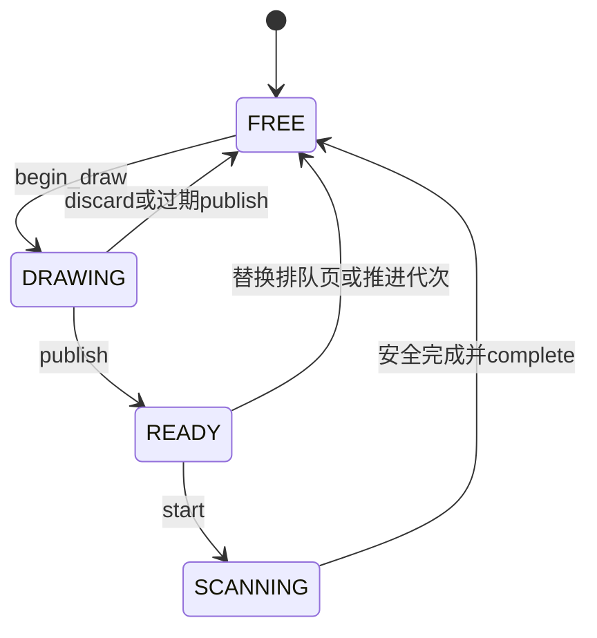

# 存储租约与显示任务维护契约

自0.0.4起实现共享C状态机，可在主机测试，并接入工程启动/模拟器。本文定义已实现接口及使用约束；新增内容身份/A-B文件记录的契约见 [持久位置](PERSISTENCE.md)。后续已有TXT/EPUB阅读、文件包装与传输工作任务；完整产品与真实USB交接仍待完成，当前范围见 [PROJECT_STATUS](PROJECT_STATUS.md)。

## 1. 所有权与线程边界

`pn_media_t`与`pn_display_t`由各自服务owner串行调用，不自带锁，不可从两个任务/ISR同时操作。未来worker通过消息请求服务，不直接竞争共享状态；owner授予的像素写入权可以交给绘制者，完成后由owner发布。对象初始化后不可移动；重新初始化前必须确认外部句柄与消费者全部结束。

结构公开便于静态分配与诊断，调用方不得自行改slots、计数、epoch、ticket或状态。句柄副本不能延长所有权；成功释放后所有副本都失效。票号和代次不回绕，耗尽后返回LIMIT并停止发新句柄。

## 2. 介质状态与租约

`pn_media_init`从不可用状态开始。真实非破坏挂载成功后，owner用非零media_id调用 `pn_media_attach`；这是介质实例标记，不是书籍SHA。attach每次推进epoch；已可用或旧租约仍存活时返回BUSY。

| 请求 | 当前状态 | 结果 |
| --- | --- | --- |
| READ | 可用、无WRITE/USB、无USB栅栏 | 可与其他READ共存，最多16个租约 |
| WRITE | 可用、无其他租约、无USB栅栏 | 独占，结束后release |
| USB | 已request_usb且全部租约排空 | 独占；仍须真实交接适配成功 |
| 任意取得 | 不可用或已拔卡 | STALE_MEDIA |
| 任意提交 | 租约epoch过期 | STALE_MEDIA，不能保存旧卡结果 |
| release | 匹配旧代活动租约 | 成功排空；不触发挂载或格式化 |
| 重复release/错误服务/篡改票号 | 找不到匹配活动租约 | INVALID，计数不变 |

`pn_media_request_usb`建立栅栏，阻止新READ/WRITE，已有句柄可以完成安全的停止和释放。栅栏建立成功不等于介质已经交出。后续真实交接必须按“关消费者/同步→租约归零→实际卸载→确认USB独占→向主机暴露”顺序执行；任一步失败不向主机暴露可写介质。当前代码只实现仲裁，没有TinyUSB或卸载操作。

USB结束后先停止主机访问和同步，release USB租约，再完成实际重新挂载；只有确认设备访问条件成立后才能cancel_usb移除栅栏。拔卡用detach立即停止新取得/提交，并通知消费者停止I/O；它保留旧槽直到release，防止旧消费者未停就用同一槽访问新卡。挂载恢复必须等待全部旧句柄排空。

WRITE与READ互斥是当前简单约束，长上传不能持有WRITE整段时间同时宣称继续阅读。后续导入服务应按有界写块/持久提交短暂持有，读取者保留准备好的页，并进行明确调度。validate只检查软件代次，不保证物理卡在下一次I/O中不会消失；文件操作仍处理短读、I/O错误和实际介质检测。租约不是FAT事务原子性保证。

## 3. 显示缓冲状态

初始化绑定1至3个相同逻辑几何的帧，像素存储不可相同或部分重叠，不在调度器内动态分配。帧描述和存储在消费者结束前保持有效；调用者不能擅改stride/尺寸或缓存失效指针。



- begin_draw仅授予当前token，返回独占可写帧；publish后不得再写此前缓存的像素指针。
- 同时最多一个SCANNING和一个READY。新publish替换尚未开始的READY，不能改正在扫描的帧。
- start只能由唯一显示owner调用；已有扫描返回BUSY。下层波形扫描、等待和物理完成由适配层负责。
- current token按session再generation单调前进。推进时释放旧READY，但旧DRAWING由worker停止后discard/过期publish回收；旧SCANNING必须安全结束后complete。
- complete验证服务、槽、票号、token、帧引用及页面元数据。错误完成或重复完成返回INVALID，不释放当前有效扫描。
- 旧token完成返回STALE_JOB并释放自身扫描槽；此状态不能更新新会话页码/进度。当前代扫描失败返回IO并释放，恢复策略另由未来显示适配实现。

这是一套调用契约，C语言无法阻止违规写入已缓存的裸指针。真实worker集成时必须通过lease协议移交所有权，不能用状态机测试通过代替跨任务数据竞争测试。它也不会自动清除屏幕已经呈现的旧像素；切会话时等待旧波形安全结束，再显示新页面，避免中途断相。

## 4. 已接入与模拟场景

工程固件使用一个逻辑缓冲，经begin_draw/publish/start后映射到BSP framebuffer，等待GC16结束，再complete与释放逻辑缓冲。存储仲裁器仅根据当时BSP挂载结果初始化诊断状态，尚无文件消费者或持续拔卡事件监听；不能声称设备端拔卡恢复已完成。

模拟器普通捕获使用相同单缓冲路径。新增固定的ownership场景：旧会话帧开始扫描→推进generation→新帧准备→旧完成被判STALE_JOB→新帧取得并捕获。其顺序是确定性软件回放，未模拟物理耗时或完整用户界面。

```bash
./build-sim-idf/pn_sim --headless --scenario ownership --capture build-sim/artifacts/ownership.pgm
```

该场景使用三个415872-byte缓冲，默认2MiB分配预算，覆盖分配头；普通场景仍默认1MiB。显式 `--budget`覆盖默认。预算不足会释放已成功分配的帧，不创建捕获文件，报告used=0/live=0。当前支持固定场景，不支持任意JSON脚本。

## 5. 可复跑验证与未完成范围

```powershell
python tools/dev.py host
python tools/dev.py sim
python tools/dev.py firmware-ci
python tools/dev.py firmware-board
```

host包含media/display测试；display固定种子进行20,000次事件组合，检查队列/扫描数量、所有权一致及最后排空。sim检查普通与旧扫描场景像素一致、失败分配释放和非法CLI参数；都在ASan/UBSan主机环境运行。两种IDF配置交叉编译不能替代上板。

T04已实现内容SHA、A/B记录及TXT位置载荷；还需通用文件服务、内部非破坏挂载、保存屏障、实际拔卡和掉电恢复；T05还需真实输入路由、damage、RTOS队列、显示欠载恢复与硬件验证。PDF可行性与许可门仍未完成，本状态机不证明其内存/性能可行。
